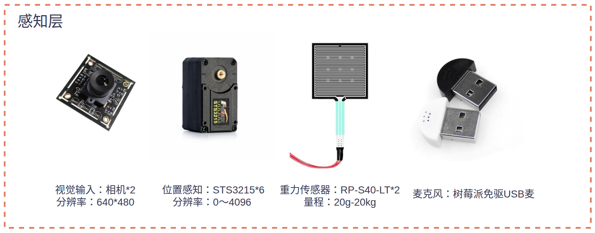
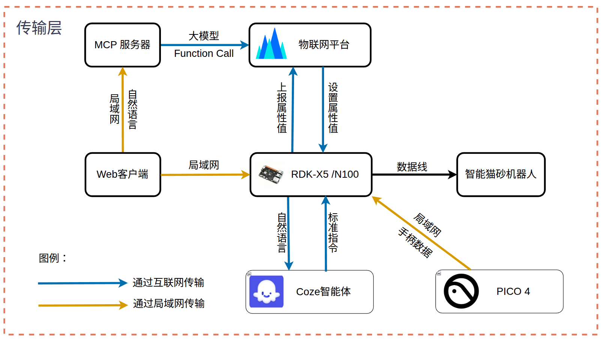
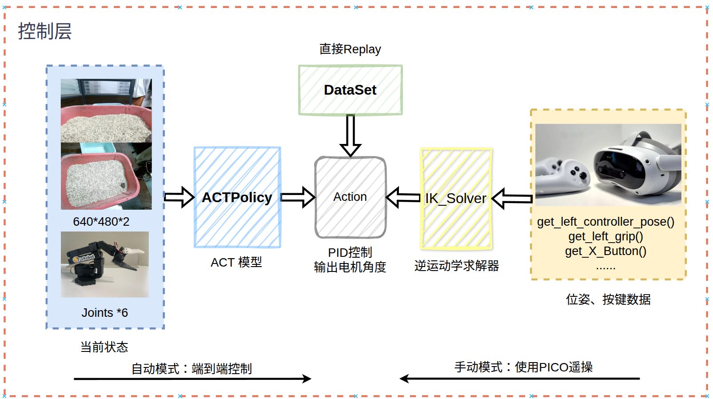

# Shovel It! | 铲了吗

[English](#english) | [中文](./README_zh.md)

Note: Core code will be uploaded to [src](./src) after patent application.
pretrained model will be uploaded to output folder.

---

## English

**Shovel It!** is an intelligent, automated cat litter cleaning robot developed for the 2025 National IoT Design Competition. This project leverages IoT technology to create a low-threshold, natural interaction system for automated cat litter maintenance with minimal upkeep requirements.

### Features

- **Voice Control**: Professional agent built on COZE platform for voice interaction, supporting voice commands and work schedule configuration
- **Remote Control**: Web client for remote robot operation
- **Teleoperation**: PICO XR device integration for immersive robot control
- **Automatic Cleaning**: Smart detection of cat entry/exit and waste identification with adaptive cleaning strategies
- **Replaceable End Effector**: 3D-printed shovel attachments that are disposable and easily replaceable

### Installation

1. Clone the repository:
```bash
git clone https://github.com/7kevin24/shovel_it.git
cd shovel_it
```

2. Install LeRobot dependency (Linux required):
   Follow the installation guide for [LeRobot](https://github.com/huggingface/lerobot). We recommend using Conda for Python environment management.

3. Install XRobotics-SDK for teleoperation functionality:
   - [XRoboToolkit-PC-Service](https://github.com/XR-Robotics/XRoboToolkit-PC-Service)
   - [XRoboToolkit-PC-Service-Pybind](https://github.com/XR-Robotics/XRoboToolkit-PC-Service-Pybind)
   
   If using Conda, install these Python packages in your LeRobot environment.

4. Install remaining dependencies:
```bash
pip install -r requirements.txt
```

### Configuration

1. Update `./src/config.py` with robot parameters, joint offsets, COZE API token, pre-trained model paths, etc.
2. Update SO100 camera parameters in `lerobot/common/robot_devices/robot/configs.py` (adjust based on your setup - we use two 640×480 RGB cameras).

### Usage

```bash
python ./src/main.py
```

### System Architecture

#### Perception Layer


The intelligent cat litter cleaning robot employs multiple sensors for environment perception and user input:

1. **Visual Input**: Two 640×480 RGB cameras capturing top and side views of the litter box for AI-powered cat behavior detection and ACT model input
2. **Position Input**: SO100 open-source robotic arm with 6 STS3215 servo motors and encoders (0-4096 encoding range, 0°-360° working range)
3. **Weight Sensors**: Installed under the litter box and waste container for intelligent detection of cat entry/exit and waste events
4. **User Input**: Raspberry Pi USB microphone for voice command reception and COZE agent interaction

#### Communication Layer


The system utilizes LAN connectivity with Volcano Engine IoT platform for data transmission and device management, plus COZE platform API access:

1. **Development Board ↔ IoT Platform**: OneSDK for property/event reporting and command reception
2. **Development Board ↔ COZE Platform**: WebSocket and HTTP API for voice recognition and agent interaction
3. **Development Board ↔ PICO XR**: High-frequency 6DOF pose and control data transmission
4. **Development Board ↔ Robotic Arm**: USB connections for microphone, cameras, and serial bus servo control

#### Control Layer


Three operational modes:

**Upper Layer Control:**
1. **Automatic Mode**: Autonomous cleaning based on cat behavior detection
2. **Assisted Mode**: User-initiated cleaning via web client or voice commands
3. **Manual Mode**: Direct teleoperation via PICO XR or other interfaces

**Lower Layer Control:**
1. **ACT Model Control**: Action Chunking with Transformer for surface and deep cleaning policies
2. **Replay Dataset Control**: Pre-recorded trajectory playback for repetitive tasks
3. **Teleoperation Control**: Real-time XR device control with inverse kinematics

#### Software Design


Key modules:
- **Global State Management**: Shared state dictionary for system coordination
- **LeRobot Integration**: Model loading, dataset handling, and motor control
- **Voice Interaction**: Multi-threaded voice processing with COZE integration
- **IoT Platform Integration**: MCP server with web client interface


## License

This project is licensed under the Apache License 2.0 - see the [LICENSE](LICENSE) file for details.

---

**Competition**: 2025 National IoT Design Competition  
**Team**: 407 
**Repository**: https://github.com/7kevin24/shovel_it