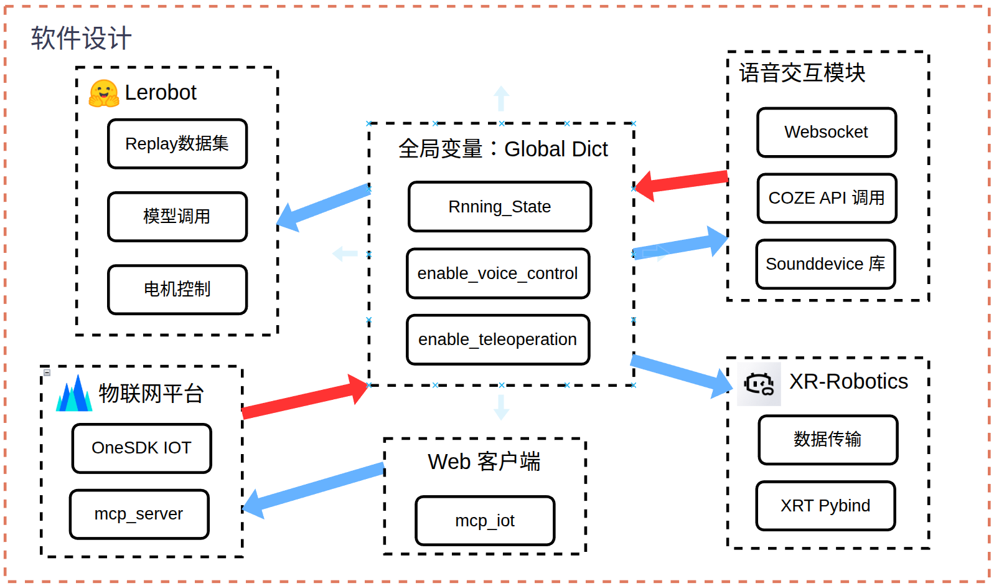

# 铲了么

Note: 核心代码将在申请专利之后上传至[src](./src)文件夹，预训练模型将上传至output文件夹。

[English](./README.md) | [中文](./README_zh.md)

---
是2025年全国物联网设计大赛参赛作品，旨在通过物联网技术实现智能、低维护成本、用户友好的自动化猫砂清理机器人。

### 功能特性

- **语音控制**：基于COZE平台的专业agent，支持语音指令控制和工作时间设定
- **远程控制**：通过Web客户端实现机器人远程操作
- **遥操控制**：集成PICO XR设备进行沉浸式机器人控制
- **自动清理**：智能识别猫咪行为和排泄物位置，采用自适应清理策略
- **可更换末端**：3D打印铲子组件，一次性使用，便于更换

### 安装步骤

1. 克隆仓库：
```bash
git clone https://github.com/7kevin24/shovel_it.git
cd shovel_it
```

2. 安装LeRobot依赖（需要Linux系统）：
   参考 [LeRobot](https://github.com/huggingface/lerobot) 安装指南，推荐使用Conda管理Python环境。

3. 安装XRobotics-SDK遥操功能依赖：
   - [XRoboToolkit-PC-Service](https://github.com/XR-Robotics/XRoboToolkit-PC-Service)
   - [XRoboToolkit-PC-Service-Pybind](https://github.com/XR-Robotics/XRoboToolkit-PC-Service-Pybind)
   
   如使用Conda环境，可将这两个Python包安装在LeRobot环境中。

4. 安装其余依赖：
```bash
pip install -r requirements.txt
```

### 配置说明

1. 更新 `./src/config.py` 文件，配置机器人参数、关节偏移、COZE API Token及预训练模型路径等
2. 在 `lerobot/common/robot_devices/robot/configs.py` 中更新SO100相机参数（根据实际情况调整，我们使用640×480 RGB相机×2）

### 运行方式

```bash
python ./src/main.py
```

### 系统实现

#### 感知层


智能猫砂清洁机器人采用多种传感器感知环境和接收用户输入：

1. **视觉输入**：两个640×480像素RGB摄像头，拍摄猫砂盆顶部和侧面图像，配合大模型检测猫咪行为，同时作为ACT模型输入
2. **位置输入**：SO100开源机械臂，6个STS3215伺服电机配合编码器（编码范围0-4096，工作范围0°-360°）
3. **重力传感器**：安装在猫砂盆和废物桶底部，配合摄像头智能识别猫咪进出和排泄行为
4. **用户输入**：树莓派USB麦克风，接收语音指令并与COZE agent交互

#### 传输层


系统使用局域网连接，利用火山引擎物联网平台进行数据传输和设备管理，通过API访问COZE平台：

1. **开发板↔物联网平台**：通过OneSDK上报属性和事件，接收指令下发
2. **开发板↔COZE平台**：WebSocket和HTTP API实现语音识别和agent交互
3. **开发板↔PICO XR**：高频率6DOF姿态和控制数据传输
4. **开发板↔机械臂**：USB连接麦克风、摄像头及串口总线舵机驱动

#### 控制层


三种操作模式：

**上层控制方式：**
1. **自动模式**：基于猫咪行为检测的自主清洁
2. **辅助模式**：用户通过web客户端或语音指令发起清洁
3. **手动模式**：通过PICO XR或其他接口直接遥操

**下层控制方式：**
1. **ACT模型控制**：基于Transformer的动作分块算法，针对表面和深度清理的不同策略
2. **Replay数据集控制**：预录制轨迹回放，适用于重复性任务
3. **遥操控制**：XR设备实时控制，结合逆运动学解算

#### 程序设计


主要模块：
- **全局状态管理**：Global Dict共享系统状态信息
- **LeRobot集成**：模型加载、数据集处理和电机控制
- **语音交互模块**：多线程语音处理与COZE集成
- **物联网平台集成**：MCP服务器配合web客户端界面

---

## License

This project is licensed under the Apache License 2.0 - see the [LICENSE](LICENSE) file for details.

---

**Competition**: 2025 National IoT Design Competition  
**Team**: 407 
**Repository**: https://github.com/7kevin24/shovel_it